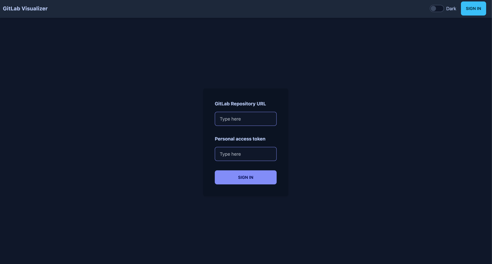
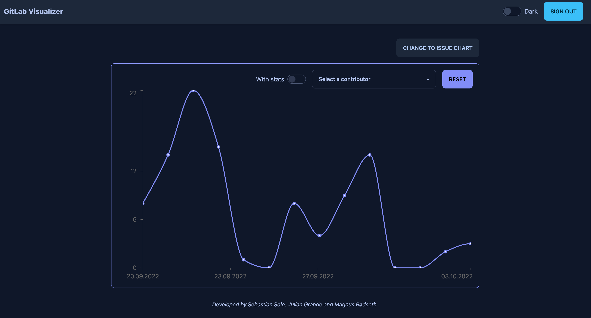
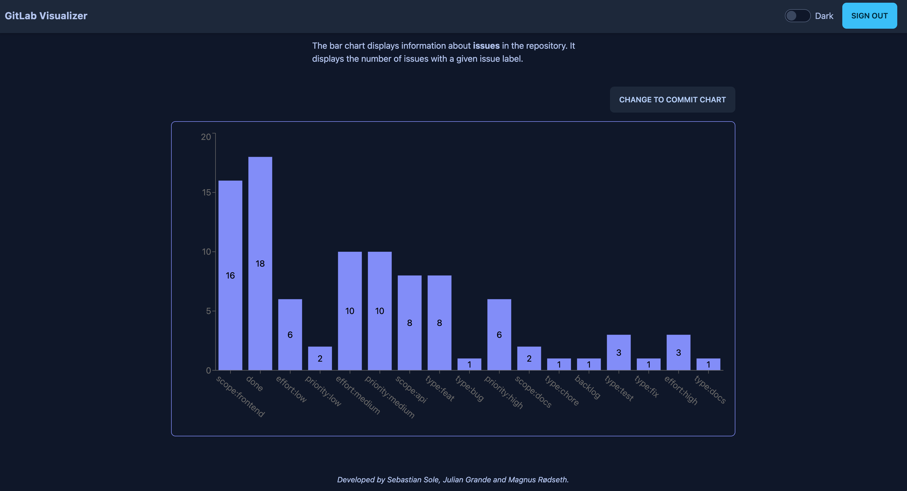

# IT2810: Project 2

## Description

This project is a visualizer of data from the GitLab REST API, specifically commits and issues.

As a user, you log in using a project URL and a personal access token, and can see relevant data about your personal repository.

## Screenshots 📷

### Login



### Commits



### Issues



## Live demo

Please use [this link](http://it2810-11.idi.ntnu.no/project2) to visit a live demo of the website.

## Developer Information

Developed by Sebastian Sole, Julian Grande and Magnus Rødseth.

## Documentation

Please read the [`docs` documentation](/docs/README.md).

## Tech stack and libraries

- React
- TypeScript
- Tailwind
- Daisy UI, a component library built on top of Tailwind
- React Query, for lazy loading data when fetching data
- Jest
- React Testing Library
- Recharts, for visualizing data

## Running the application

### Personal access token

If you have not done so already, create a personal access token using [this guide](https://docs.gitlab.com/ee/user/profile/personal_access_tokens.html#create-a-personal-access-token).

### Run the application

```sh
# Navigate to the project directory
cd project-2

# Install dependencies
npm install

# Start the application
npm start

# Test the application
npm test
```

For other available scripts, please see [`package.json`](package.json)
